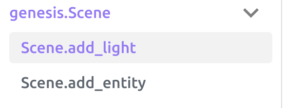
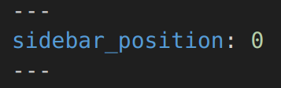
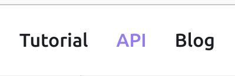

# Website

This website is built using [Docusaurus](https://docusaurus.io/), a modern static website generator.

### Installation

```
$ yarn
```

### Local Development

```
$ yarn start
```

This command starts a local development server and opens up a browser window. Most changes are reflected live without having to restart the server.

### Build

```
$ yarn build
```

This command generates static content into the `build` directory and can be served using any static contents hosting service.

### Deployment

Using SSH:

```
$ USE_SSH=true yarn deploy
```

Not using SSH:

```
$ GIT_USER=<Your GitHub username> yarn deploy
```

If you are using GitHub pages for hosting, this command is a convenient way to build the website and push to the `gh-pages` branch.


### Sidebar Position
If you want to change the API position:


You can change `sidebar_position` in `md` API file  


### Change API bar



You can change API to xxxx in:
`website/docusaurus.config.js`
(Try to search API1111, you can find where to modify)

### Slug meaning:

When using some super link you may use this, but we haven't use slug yet.

> `slug: api/Genesis Tools API/entity` means that the page or section being described is associated with that specific path in the URL. It's used for routing and can help with SEO by making URLs more understandable to both users and search engines. The slug should be concise and descriptive, reflecting the content or topic of the page it refers to.

### API title:
+ If you add `# title level 1`, the name will be `title level 1`
+ If you do not add `# title level 1`, the name will be the title of markdown file 
