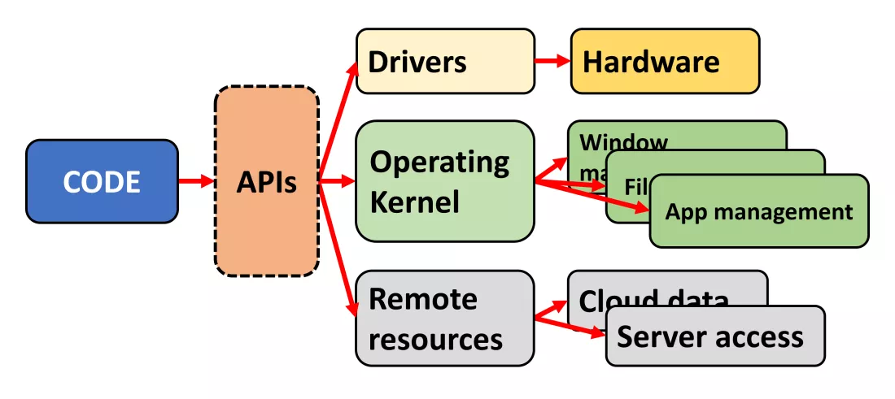

# Entity {#Entity}

export const Highlight = ({children, color}) => (
  <span
    style={{
      backgroundColor: color,
      borderRadius: '10px',
      color: '#fff',
      padding: '10px',
      cursor: 'pointer',
    }}
    onClick={() => {
      alert(`You clicked the color ${color} with label ${children}`);
    }}>
    {children}
  </span>
);

<Highlight color="#79a2db">class **nvisii.entity** (*args, **kwargs)</Highlight>

<br />
<br />

**[`class nvisii.entity(*args, **kwargs)`](https://github.com/Genesis-Embodied-AI/genesis-embodied-ai.github.io)**

```python title="nvisii.entity"
class nvisii.entity(*args, **kwargs)
```

> An [**Entity**](https://github.com/Genesis-Embodied-AI/genesis-embodied-ai.github.io) is a component that is used to connect other component types together.sssss
> If you’d like to place an object in the scene, an Entity would be used to connect a Mesh component, a Transform component, and a Material component together.
> 
> Only one component of a given type can be connected to an entity at any given point in time.
> 
> Multiple entities can “share” the same component type. For example, a sphere mesh component can be referenced by many entities, with each entity having a unique material. This is essentially a form of “instancing”. Alternatively, many different entities can share the same Material component, such that any adjustments to that material component effect a collection of objects instead of just one.


### Static **`get(name)`** [[source](https://github.com/Genesis-Embodied-AI/genesis-embodied-ai.github.io)]  {#get}


- **Type**: `boolean | undefined`
- **Parameters**: 
    - `name` (string) - The name of the entity to get.
    - `name` (string) - The name of the entity to get.
    - `name` (string) - The name of the entity to get.
    - `name` (string) - The name of the entity to get.
- **Return Type**: `Entity`
- **Returns**: An entity whose name matches the given name.

:::info
This method is part of the kinematics library and is used for inverse kinematics calculations. It utilizes Taichi (`ti.kernel`) to perform efficient computations. For more information on Taichi kernels, refer to [Taichi Documentation](https://taichi.graphics/docs/lang/articles/advanced/kernel).
:::

### Property **`thisown`**
The membership flag.

<details>
<summary>Figure Example, Click to expand</summary>


</details>


### static **`create(name, transform=None, material=None, mesh=None, light=None, camera=None, volume=None)`**
> **Static Method**

Constructs an Entity with the given name.

**Parameters:**

| Name       | Type       | Description |
|------------|------------|-------------|
| name       | string     | The name of the entity. |
| transform  | Transform  | Optional. A transform component places the entity into the scene. |
| material   | Material   | Optional. Describes the appearance of the entity when rendered. |
| mesh       | Mesh       | Optional. Describes a surface to be rendered. Cannot be assigned if a "volume" component is also assigned. |
| light      | Light      | Optional. Indicates that the geometry should act like a light source. |
| camera     | Camera     | Optional. Indicates that the entity can be used to view the scene. |
| volume     | Volume     | Optional. Describes volumetric particles to be rendered. Cannot be assigned if a "mesh" component is also assigned. |

**Return Type:** `Entity`

**Returns:**
A reference to the created Entity.


### `get_count()`

- **Type**: `static`
- **Return Type**: `int`
- **Returns**: The number of allocated entities.

### `get_name()`

- **Return Type**: `string`
- **Returns**: The name of this component.

### `get_id()`

- **Return Type**: `int`
- **Returns**: The unique integer ID for this component.


### `get(name)`
> **Static Method**

**Parameters:**

| Name | Type   | Description                  |
|------|--------|------------------------------|
| name | string | The name of the entity to get. |

**Returns:**

- **Type**: `Entity`
- **Description**: An entity whose name matches the given name.

---

### `get_count()`
> **Static Method**

**Returns:**

- **Type**: `int`
- **Description**: The number of allocated entities.

---

### `get_name()`

**Returns:**

- **Type**: `string`
- **Description**: The name of this component.

---

### `get_id()`

**Returns:**

- **Type**: `int`
- **Description**: The unique integer ID for this component.

---
import APITable from '@site/src/components/APITable';

```python title="classnvisii.entity(*args, **kwargs)"
@ti.kernel
def genesis_tool_api(
    links_idx: ti.types.ndarray(),
    poss: ti.types.ndarray(),
    quats: ti.types.ndarray(),
    n_links: ti.i32,
    custom_init_q: ti.i32,
    init_q: ti.types.ndarray(),
    max_samples: ti.i32,
    max_solver_iters: ti.i32,

)
```

## Optional fields {#optional-fields}

### `links_idx` {#links_idx}

Path to your site favicon; must be a URL that can be used in link's href. For example, if your favicon is in `static/img/favicon.ico`:

```js title="API 1"
export default {
  favicon: '/img/favicon.ico',
};
```

### `links_idx` {#links_idx}

- Type: `boolean | undefined`

Allow to customize the presence/absence of a trailing slash at the end of URLs/links, and how static HTML files are generated:

- `undefined` (default): keeps URLs untouched, and emit `/docs/myDoc/index.html` for `/docs/myDoc.md`
- `true`: add trailing slashes to URLs/links, and emit `/docs/myDoc/index.html` for `/docs/myDoc.md`
- `false`: remove trailing slashes from URLs/links, and emit `/docs/myDoc.html` for `/docs/myDoc.md`

### `onBrokenAnchors` {#onBrokenAnchors}

- Type: `'ignore' | 'log' | 'warn' | 'throw'`

The behavior of Docusaurus when it detects any broken anchor declared with the `Heading` component of Docusaurus.

By default, it prints a warning, to let you know about your broken anchors.

### `onBrokenMarkdownLinks` {#onBrokenMarkdownLinks}

- Type: `'ignore' | 'log' | 'warn' | 'throw'`

The behavior of Docusaurus when it detects any broken Markdown link.

By default, it prints a warning, to let you know about your broken Markdown link.
